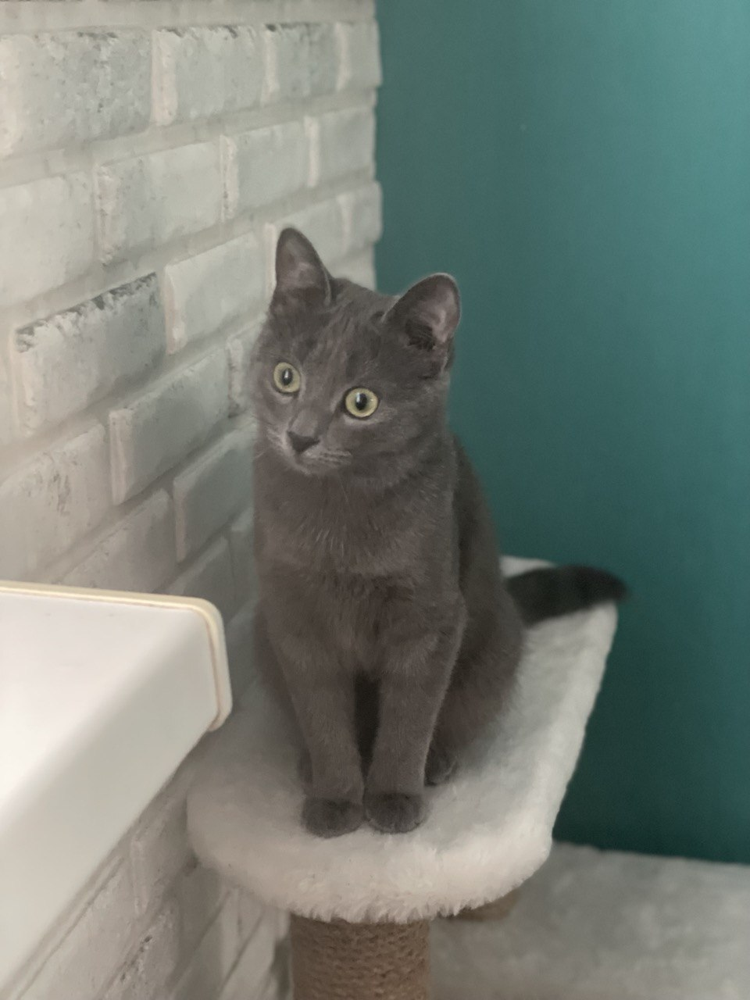
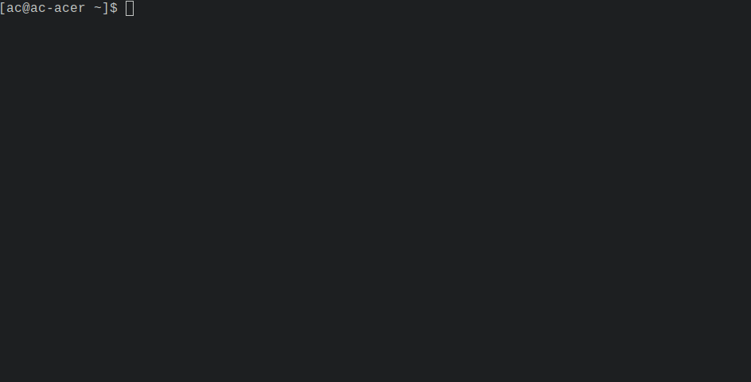

SL(1): Cure your bad habit of mistyping
=======================================

SL (~~Steam Locomotive~~ Skoda Lurks) runs across your terminal when you type "sl" as
you meant to type "ls". It's just a joke command, and not useful at
all.

# Update notes for cat version

This is Skoda: 



and she lurks.

## How to run

Skoda is hidden under flag -C, so, to enjoy unexpected lurking, add alias:

```alias sl="sl -C"```

## Cat ASCII art source
https://www.asciiart.eu/animals/cats

# Update notes from eyJhb
I have merged the following 

- [Add SIGIN configuration and disco mode](https://github.com/mtoyoda/sl/pull/55)
- [Add option for the number of cars](https://github.com/mtoyoda/sl/pull/56)

I have also added `-v` and updated the last updated and version number to 5.04.


Copyright 1993,1998,2014,2019 Toyoda Masashi (mtoyoda@acm.org)


